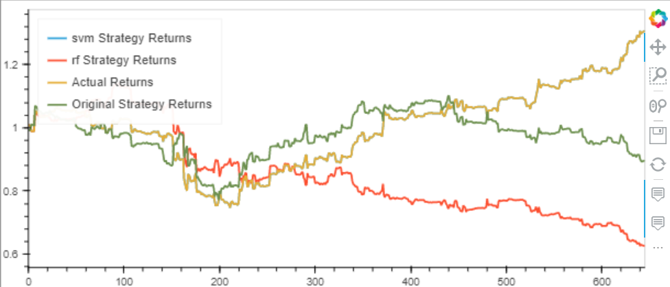

# 14th_Challenge

## Summary of Purpose  

This is not a program/app.  

Given 6 years worth of data for a certain stock (I'm not sure whether or not the data I used was real),  
I made 3 trading algorithms and compared their respective performances.

---

## Required/Compatible Technologies

**Compatible OS's:** Mac, Windows, or Linux  
**Programming language:** Python inside of a Jupyter Notebook (filetype: .ipynb)  
**Required libraries/installations:**  

    import pandas as pd
    import numpy as np
    from pathlib import Path
    import hvplot.pandas
    import matplotlib.pyplot as plt
    from sklearn import svm
    from sklearn.svm import SVC
    from sklearn.preprocessing import StandardScaler
    from pandas.tseries.offsets import DateOffset
    from sklearn.metrics import classification_report
     
Using a conda environment from anaconda is preferable.

----
## How to Open the Code

You *can* view it on this github repository, except for the hv-plots.

You should use Jupyter Lab or some program that can run .ipynb files (e.g. VS Code using some extensions/add-ons).

The cells should have already been run. If some haven't been run, then restart the kernel and run all the cells.

---

## Contributors

Noah Saleh

email: noahgsaleh@gmail.com

---

## Results/Analysis

I was getting really inconsistent results when tweaking parameters.  

I then realized the data was the problem. The data has some updates 15 minutes, 45 minutes, or even an hour. Other updates are days apart-- I've seen gaps in the data as large as 6 days. The rolling averages are thus inconsistent, and so the algorithms struggled.

The SVM strategy just bought and held the stock so it's performance lines up with the "Actual Returns" line (it doesn't do this when you give the SVM model a lot less data, but I wanted to give the models plenty of data).

### Graph of the Cumulative Returns of the 3 Strategies & the Returns of the Stock Itself vs. Time

  